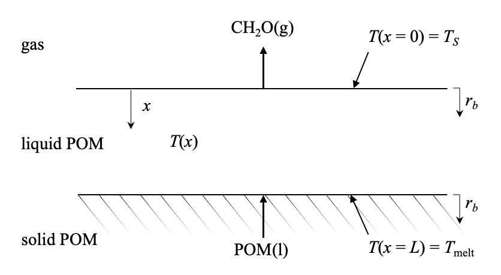

# POM Model

## V0.9

Regression rate with given heat flux:
```math
r_b=\frac{\dot{Q}_0''}{\rho(\Delta h_{\rm LH}+\frac{\Delta_rH}{{\rm MW}_0})}.
```

Regression rate with given surface temperature:
```math
r_b=\frac{kE_a}{\Delta h_\text{LH}\rho R_u}\sqrt{\frac{2\tilde{A}[g(\tilde{\theta}_S)-g(\tilde{\theta}_\text{melt})]}{(1+\tilde{h})^2-1}},
```

where

```math
\tilde{A}=\frac{2\Delta_rH\rho A_\beta R_u\gamma}{{\rm MW}kE_a},\quad \tilde{\theta}_S=\frac{R_uT_S}{E_a},\quad \tilde{\theta}_{\rm melt}=\frac{R_uT_{\rm melt}}{E_a},\quad \tilde{h}=\frac{\Delta_rH}{{\rm MW}_0\Delta h_{\rm LH}},\\

g(u)={\rm Ei}\left(-\frac{1}{u}\right)+u\exp\left(-\frac{1}{u}\right),\quad {\rm Ei}(u)=\int_{-\infty}^u\frac{\exp(t)}{t}{\rm d}t.
```

### Parameters and source

- $k$ = 0.14 W/m$\cdot$K[^1]
- $\rho$ = 1.2 g/cm<sup>3</sup>[^2]
- ${\rm MW}_0$ = 30 g/mol
- ${\rm MW}$ = 1e5 g/mol[^3]
- $A_\beta$ = 1.8e13 s<sup>-1</sup>[^4]
- $E_a$ = 30 kcal/mol[^5][^6][^7][^8][^9]
- $\Delta_rH$ = 56 kJ/mol[^10]
- $\Delta h_{\rm LH}$ = 150 J/g[^11]
- $T_{\rm melt}$ = 165$`^\circ`$C[^12][^13]
- $\gamma$ = 1
- $R_u$ = 8.314 J/mol$`\cdot`$K

### Schematic



### Assumptions

- Homogeneous in $y$, $z$ directions. 1D steady state problem.
- Constant $k$, MW, $\rho$, $\gamma$.
- Chemical reaction only occurs in the liquid phase.
- Regression is only due to releasing CH<sub>2</sub>O. No POM vaporization.
- The initiation reaction  is neglected [CH<sub>3</sub>COO(CH<sub>2</sub>O)$_n$COCH<sub>3</sub> $\rightarrow$ (CH<sub>2</sub>O)$_n$].

### Nomenclature

Profile variables:

- $T$: temperature, K;
- $x$: depth, m;

Properties which need to be assigned:

- $\rho$: liquid phase density, kg/m<sup>3</sup>;
- $k$: liquid phase thermal conductivity, W/m$\cdot$K;
- $\Delta_rH$: heat of reaction, J/mol;
- $\Delta h_{\rm LH}$: latent heat of POM fusion, J/kg;
- MW: POM molecular weight, kg/mol;
- MW$_0$: POM monomer (CH<sub>2</sub>O) molecular weight;
- $A_\beta$: intrinsic pre-exponential factor for C $y$O $\beta$-scission, s<sup>-1</sup>;
- $E_a$: activation energy for POM decomposition, J/mol;
- $R_u$: universal gas constant, J/mol$\cdot$K;

Six properties linked with three equations:

- $\dot{Q}_0''$: heat flux through the top surface, W/m<sup>2</sup>.
- $r_b$: regression rate of the top surface, m/s;
- $L$: liquid layer thickness, m;
- $T_S$: surface temperature at liquid-gas interface, K;
- $T_{\rm melt}$: POM melting point, temperature at solid-liquid interface, K;
- $\gamma$: pre-exponential factor temperature-dependent correction.

## Reference

[^1]: **POM handbook.** S. Luftl, P. Visakh, S. Chandran, Polyoxymethylene handbook: structure, properties, applications and their nanocomposites, John Wiley & Sons, 2014.
[^2]: **Paper.** H. W. Starkweather Jr., G. A. Jones, P. Zoller, The pressure-volume-temperature relationship and the heat of fusion of polyoxymethylene, Journal of Polymer Science Part B: Polymer Physics 26 (2) (1988) 257–266.
[^3]: **Estimated.** Range from 1e4 – 2e5 g/mol.
[^4]: **Diethyl ether kinetic model. Beta-scission of CH<sub>3</sub>OCH<sub>2</sub>O = CH<sub>3</sub>O + CH<sub>2</sub>O.** From: L.-S. Tran, J. Pieper, H.-H. Carstensen, H. Zhao, I. Graf, Y. Ju, F. Qi, K. Kohse-Hoinghaus, Experimental and kinetic modeling study of diethylether flames, Proceedings of the Combustion Institute 36 (1) (2017) 1165–1173.
[^5]: **Paper.** G. Berkowicz, T. M. Majka, W.  ̇Zukowski, The pyrolysis and combustion of polyoxymethylene in a fluidised bed with the possibility of incorporating CO<sub>2</sub>, Energy Conversion and Management 214 (2020) 112888.
[^6]: **Paper.** M. Day, J. D. Cooney, C. Touchette-Barrette, S. E. Sheehan, Pyrolysis of mixed plastics used in the electronics industry, Journal of Analytical and Applied Pyrolysis 52 (2) (1999) 199–224. 
[^7]: **Paper.** V. M. Archodoulaki, S. Luftl, S. Seidler, Thermal degradation behaviour of poly(oxymethylene): 1. Degradation and stabilizer consumption, Polymer Degradation and Stability 86 (1) (2004) 75–83.
[^8]: **Paper.** J. Shi, B. Jing, X. Zou, H. Luo, W. Dai, Investigation on thermo-stabilization effect and nonisothermal degradation kinetics of the new compound additives on polyoxymethylene, Journal of Materials Science 44 (5) (2009) 1251–1257.
[^9]: **Paper.** E. J. Grajales, E. A. Alarcon, A. L. Villa, Kinetics of depolymerization of paraformaldehyde obtained by thermogravimetric analysis, Thermochimica Acta 609 (2015) 49–60.
[^10]: **Group additivity calculation using NIST data.**
[^11]: **Paper.** D. Czarnecka-Komorowska, T. Sterzynski, Effect of Polyhedral Oligomeric Silsesquioxane on the Melting, Structure, and Mechanical Behavior of Polyoxymethylene, Polymers 10 (2) (2018) 203.
[^12]: **Product report.** DURACON® POM report. https://www.polyplastics.com/en/support/mold/duracon/pom04c.html#:~:text=The%20melting%20point%20of%20DURACON,cylinder%20temperature%20(front%20section).
[^13]: **Paper.** K. Pielichowska, The influence of molecular weight on the properties of polyacetal/hydroxyapatite nanocomposites. Part 1. Microstructural analysis and phase transition studies, Journal of Polymer Research 19 (2) (2012) 9775.
